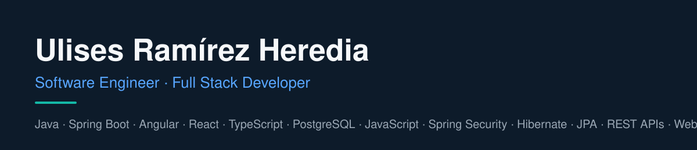

## About

I'm a Software Engineer and Full Stack Developer with 4+ years of experience building web applications and enterprise software throughout the full development lifecycle.

My experience includes designing REST APIs, implementing authentication and authorization, building reusable UI components, integrating third-party services, and optimizing application performance. I enjoy working across the stack, learning new technologies, and collaborating with international, remote-first engineering teams.

Based in Havana, Cuba.

---

## Tech Stack

| Area | Technologies |
|---|---|
| Programming Languages | Java, JavaScript, TypeScript, PHP, SQL |
| Frontend | Angular, Thymeleaf, HTML5, CSS3, Bootstrap, Tailwind CSS, RxJS |
| Backend & APIs | Spring Boot, Spring Security, Hibernate, JPA, REST APIs, WebSocket, STOMP, OAuth2, Keycloak |
| Databases | PostgreSQL, MySQL |
| Tools & Platforms | Git, GitLab, Postman, Maven, GraphQL, Squidex, VS Code |

---

## Selected Projects

- **[SGE — Backend](https://github.com/yerandis/sge-backend)** — Backend for an employee management system, built with Spring Boot and PostgreSQL.
- **[SGE — Frontend](https://github.com/yerandis/sge-frontend)** — React and TypeScript frontend for the employee management system.
- **[Lumen Blog API](https://github.com/yerandis/lumen_blog_api)** — PHP project built with the Lumen framework.

---

## Professional Experience

### Full Stack Developer · Enterprise Software Company
**Sep 2024 – Jun 2026**

- Contributed to the development and maintenance of enterprise web applications across the full software development lifecycle.
- Designed and integrated REST APIs connecting frontend applications, backend services, and third-party systems.
- Implemented authentication and authorization flows using JWT and session management.
- Improved application performance by optimizing database queries and reducing redundant network requests.
- Built reusable UI components and shared backend libraries.
- Collaborated on code reviews, technical discussions, and sprint planning.

### Software Engineer · NTSPrint
**May 2024 – Aug 2024**

Contributed to the development of Explora Jalisco, a travel and cultural discovery platform.

- Fixed frontend and backend bugs and implemented features for events, articles, and itinerary management.
- Developed end-to-end tests to validate component behavior and prevent regressions.

**Technologies:** Java, Angular, TypeScript, PHP, GraphQL, Tailwind CSS, Keycloak, Squidex, RxJS.

### IT Engineer · Ministerio de Comercio Exterior (MINCEX)
**Jan 2023 – Dec 2023**

- Developed and maintained features for a student enrollment management system for commerce training programs.
- Collaborated on technical decisions, integration challenges, and backward-compatible updates.

**Technologies:** Java, Angular, TypeScript, HTML5, CSS3, Bootstrap.

### IT Engineer · Servicios Portuarios Occidente (SEPOC)
**Jan 2022 – Jan 2023**

- Developed the frontend of an internal worker registration and management system using Angular 14.
- Resolved functional defects and integration issues in collaboration with the backend team.

**Technologies:** Angular, TypeScript, HTML5, CSS3, Bootstrap, PostgreSQL.

---

## Education & Languages

**B.Sc. in Informatics Engineering**  
Technological University of Havana (CUJAE) · Sep 2016 – Nov 2021

**Baccalaureate**  
Vocational Institute of Exact Sciences “Vladímir Ilich Lenín” (IPCVE) · Sep 2013 – Jun 2015

**Languages:** Spanish (Native) · English (Intermediate, B1–B2)

---

## Contact

[LinkedIn](https://www.linkedin.com/in/yerandis-ramirez-2516b72b6/) · [Email](mailto:uyerandisr@gmail.com)
